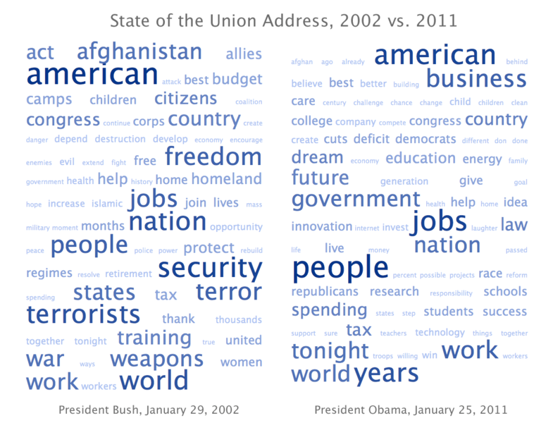
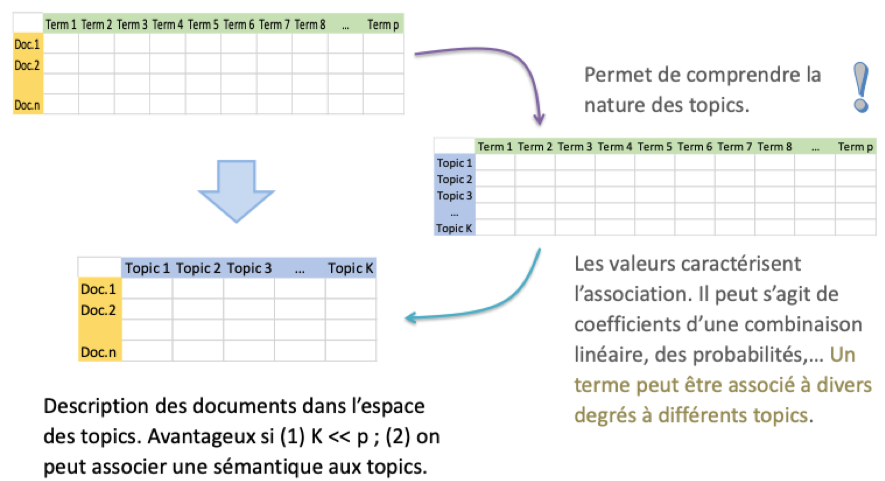

## Introduction
<div style="text-align: justify">Un ingénieur se doit d’être au courant des avancées technologiques de son domaine, de se forger son opinion et de faire sa part dans le développement de nos sciences et techniques. Or, avec les innombrables laboratoires de recherche à travers le monde, tous les médias et toutes les sources d’information, effectuer un sérieux travail de veille technologique peut être très fastidieux et chronophage. Cette activité importante, parfois délaissée aux stagiaires dans certaines entreprises, peut devenir très efficace si l’on utilise des outils adaptés, et apporte alors beaucoup de valeur.
	
</div>

<div style="text-align: justify">Dans le cadre du MOS 4.4 "Nouvelles Technologies de l’Information et de la Communication" de l’École Centrale de Lyon, nous développons des outils de veille pertinents par rapport au domaine qui nous intéresse. Le domaine que j’ai choisi est le traitement automatique du langage naturel en informatique, plus fréquemment appelé « natural language processing » (NLP).
	
</div>

<div style="text-align: justify">La NLP est une partie phare des technologies de l’information : à la jonction de la linguistique, de l’informatique et de l’intelligence artificielle, c’est la partie de cette dernière qui a le plus d’applications. Les principales sont les moteurs de recherche, tels Google et Bing, des chatbot de plus en plus « intelligents », l’analyse de sentiment, la création de résumés… L’application historique de l’apprentissage artificiel appliqué au langage est la détection des spams, pour lesquelles Gmail réussi depuis les années 2000 à bien classer plus de 98% des e-mails.
</div>

## Historique
Avant de s’intéresser à l’état actuel de la NLP, penchons-nous sur les avancées successives de cette technologie.

- Années 50 : Le test de Turing, qui permettrait de détecter une réelle « intelligence » artificielle, consiste en ce qu’un humain arriverait à distinguer un humain d’une machine dans une discussion. Le premier élément à maîtriser pour qu’une intelligence artificielle soit labellisée « intelligente », est donc le langage. Le concept de traitement du langage naturel apparaît donc dans les années 50, avec des prémices de traduction.

- Années 50 - 80 : La NLP connait un développement lent. Les seules techniques sont des algorithmes et statistiques “à la main”. Les fonds de recherche, initialement élevées, diminuent.

- Années 70 : Création des premières ontologies, c’est-à-dire représentations structurées des concepts, avec des espaces de nom ou des métadonnées. On voit également l’apparition des premiers chatbots.

- Années 90 : L’arrivée du Big Data permet l’introduction de l’apprentissage artificiel. Les premières améliorations sont sur la robustesse des algorithmes, en particulier par rapport aux erreurs d’orthographe et aux « coquilles », très courants dans les données réelles.

- Années 2010 : Le rapide développement des réseaux de neurones profonds permet de grandes améliorations. Des applications à haut niveau d’abstraction telles que l’analyse syntaxique et la génération de langage commencent à être développées.

- 2019 : 	Deux algorithmes conçus indépendamment par Alibaba et par Microsoft battent des humaines dans des tests de lecture et de compréhension de Stanford.

#### Applications actuelles
La NLP est la partie de l’intelligence artificielle qui a le plus d’applications. Les principales actuelles sont :
- L’extraction d’information ou la recherche d’information (par exemple avec les moteurs de recherche Google et Bing)

- Des chatbot de plus en plus « intelligents »

- L’analyse de sentiment

- De la traduction

- La création de résumés, de descriptifs type Wikipédia… 

- La reconnaissance vocale

- L’auto-correcteur orthographique

## Transformation préliminaire : nettoyage du texte
La première étape du traitement automatique du langage naturel, est comme pour tout domaine de la data, la récupération et la préparation des données. La préparation des données est cependant bien plus délicate et complexe pour les données textuelles que pour les données numériques.

Les étapes de cette transformation préliminaire sont :
1. Enlever la ponctuation et la casse.

2. Tokenization : mettre les mots dans des string, puis dans une liste

3. Suppression des « mots vides » (stopwords) : tous les mots qui contiennent peu de sens en propre sont éliminés. Exemples : a, à, afin, ainsi, alors, assez, auquel…

4. Extraire seulement la racine des mots. Une première technique est le **stemming**, qui consiste à tronquer le mot. Une méthode plus avancée, qui concentre beaucoup de recherches actuellement, est le **lemmatizing**, qui consiste à tronquer le mot puis à remettre les bonnes lettres pour obtenir la racine d’un mot unique. Cette tâche est très complexe, en particulier pour le français (par rapport à l’anglais), de par les nombreuses formes que peuvent prendre les mots, notamment pour la conjugaison. Par exemple, si on considère les phrases « les **avions** dans le ciel » et « nous **avions** des oranges », pour le même mot « avions », le lemmatizing idéal serait d’extraire deux racines différentes : la racine « avion » pour la première phrase, et « avoir » pour la deuxième. Par contre, dans la phrase « que nous **eussions** mangé », il faut extraire de « eussions » encore une fois le mot « avoir ». Or, « eussions » et « avions » sont 2 mots très différents.

Observons ces étapes sur un exemple. Prenons la phrase : Je vais au cinéma, puis je mange au restaurant.

1. Suppressions de la ponctuation : ‘je vais au cinema puis je mange au restaurant’

2. Tokenization : [‘je’, ‘vais’, ‘au’, ‘cinema’, ‘puis’, ‘je’, ‘mange’, ‘au’, ‘restaurant’]

3. Stopwords : [‘vais’, ‘cinema’, ‘mange’, ‘restaurant’]

4. Lemmatization : [aller, ‘cinema’, ‘manger’, ‘restaurant’]

D’autres actions sont possibles, comme par exemple écarter les mots qui apparaissent une seule fois, ou encore, faire un nuage de mots comme ci-dessous pour visualiser les mots les plus fréquents.



## Vectoriser le texte
Une fois le texte nettoyé, l’étape suivante est de vectoriser le texte. Cela signifie encoder l’ensemble de mots en un vecteur de nombres. 2 méthodes sont possibles : le N-gram et le Bag of Word.

#### Bag of Word (BoW) « de base »
Le modèle initial du Bag of Words conserve tous les mots, et consiste à mettre chaque document dans une ligne d’une matrice, avec dans chaque colonne le nombre d’occurrence du mot correspondant. Les inconvénients de cette méthode sont qu’elle ne rend pas compte de l’ordre des mots, ni des relations entre les mots.

La matrice encodée a les priorités suivantes :
- Elle a le même nombre de colonne que le nombre de mots du vocabulaire.

- Elle contient des int comptant le nombre d’occurrence de chaque mot

- Elle est sparse, c’est-à-dire qu’elle contient une grande proportion de 0. Le package scipy.parse permet de manipuler des éléments sparse efficacement.

Avec scikit-learn, le module nécessaire est CountVectorizer. Ses fonctions principales sont les suivantes :
- fit() : apprend le vocabulaire d’un ensemble de documents

- transform() : encode un ou plusieurs documents en vecteurs

#### Bag of Word TF-IDF (Term Frequency - Inverse Document Frequency) 
- « Term frequency » : fréquence d’apparition du mot dans le document (équivalent au bag of word précédent).

- « Inverse Document Frequency » : diminue les fréquences des mots présents dans de nombreux documents

Cette technique permet de faire ressortir les mots intéressants (qui apparaissent beaucoup dans un document, mais pas dans les autres). Comme précédemment, les inconvénients sont qu’elle ne rend pas compte de l’ordre des mots, ni des relations entre les mots.

C’est la méthode la plus populaire actuellement pour vectoriser le texte.

#### N-gram
Le N-gram est une méthode différente du Bag of Word. Elle rend compte de l’importance du voisinage entre les mots. Ce voisinage peut être déterminant pour certaines tâches. Par exemple, la présence de “only for you” dans un mail rend la probabilité que ce soit un spam très élevée.
Ce modèle considère toutes les associations de N mots voisins : Le chat est doux → Le chat / chat est / est doux.
L’inconvénient est que cette méthode est très coûteuse, ce qui limite N, qui vaut 2 ou 3 au maximum.

Il faut souvent revenir à de maintes reprises au nettoyage des données réelles. En particulier pour les données textuelles.

## Réduction de la dimensionnalité
Les documents traités contiennent souvent de très nombreux éléments différents, et les données sont importantes. Une réduction de de la dimensionnalité est donc nécessaire, et cela permettra aux algorithmes d’apprentissage de détecter des « patterns » dans les données.

Une méthode est le **topic modeling**, qui permet de passer dans un nouvel espace de représentations, qui est un ensemble de thèmes. Chacun est défini par les termes du vocabulaire, avec des poids plus ou moins élevés (soft/fuzzy clustering). On peut ensuite associer les documents à certains thèmes.

Cela permet de représenter les documents dans un espace intermédiaire, de plus faible dimension, tout en conservant la proximité des documents entre eux.


Source : http://eric.univ-lyon2.fr/~ricco/cours/cours_text_mining.html

## Apprentissage automatique
Après les étapes précédentes (nettoyage du texte, vectorisation et réduction de dimension), on peut appliquer des algorithmes de machine learning.

La première étape est l’analyse préliminaire, avec notamment la création de features. Des features emblématiques sont, pour l’exemple des spams, la longueur du mail, et le pourcentage de caractères qui sont de la ponctuation. Il faut ensuite choisir un modèle d’apprentissage (random Forest, XGBoost…). Puis vient l’entraînement du modèle sur les données, l’évaluation des résultats obtenus (par exemple avec une matrice de confusion, avec la précision et le taux de rappel). Enfin la mise en production pour être effectuée.

En data science, le pre-processing (la préparation des données) est très important. Et cela est vrai tout particulièrement pour la NLP, où, d’autant plus avec des données réelles, les retours au nettoyage des données sont omniprésents. 


## Génération de langage
La génération de langage est le domaine de recherche de la NLP le plus actif. De multiples laboratoires tentent de parvenir à concevoir des machines sachant rédiger des résumés, des traductions, des légendes d’images, des chatbots capables de tenir une conversation…

Cela nécessite un **modèle de langage**, qui calcule, pour un mot donné, connaissant les mots précédents, et connaissant le contexte, la probabilité qu’il soit pertinent. Une méthode simpliste est de construire la phrase la plus probable, selon l’algorithme du glouton (on sélectionne le meilleur mot à chaque fois, sans revenir en arrière). Or, cela peut mener à des phrases qui n’ont aucun sens. Une méthode plus élaborée est l’algorithme de recherche en faisceau (« beam search »). C’est une heuristique qui recalcule les probabilités après que quelques mots aient été ajoutés, et qui évite les maxima locaux.

Une application récente notable est la **création d’articles Wikipédia par Google**. Pour un sujet donné, des données sont extraites des 10 premières pages de recherche Google, hormis Wikipédia. Tous les paragraphes extraits sont classés dans un unique document (de quelques dizaines de milliers de mots), puis les longues phrases sont découpées en plus courtes. Les phrases générées sont directement extraites du texte obtenu, sans plus de reformulation. Et l’algorithme peut apprendre en comparant à la définition de Wikipédia, qui est, elle, rédigée par un humain.

#### Chatbot
Une autre application importante est le chatbot. 2 modèles sont possibles : le « retrieve » et le « generative ».
	
Pour le **retrieve model**, les données n’ont pas besoin d’être labellisées. On a un ensemble de documents que l’on met sous forme de vecteur. Pour une question donnée, il faut d’abord la transformer en un vecteur. Puis on calcule les distances cos-similarité entre la question et les documents, et le chatbot répond le document qui est le plus proche de la question.

Pour le **generative model**, il faut entraîner un réseau de neurone afin de pouvoir générer des phrases. Pour la complexité de cette tâche, du deep learning est nécessaires, avec par exemple des réseaux de neurones récurrents qui donnent des résultats corrects. De très nombreuses données, qui sont des couples question / réponse, sont nécessaires pour ce type de modèle.

## Conclusion
La NLP, partie phare des technologies de l’information, à la jonction de la linguistique, de l’informatique et de l’intelligence artificielle, possède énormément d’applications, et mobilise de nombreuses équipes de recherche, qui sont proches d’obtenir des algorithmes possédant des compétences de rédaction correctes.

Pour les ingénieurs utilisant cette technologie en production, de très nombreux retours au nettoyage des données textuelles sont nécessaires. Et ils se doivent également de prendre garde aux applications : on pourra bientôt lire des articles Wikipédia qui n’auront pas été rédigés par des humains, et certaines applications actuelles soulèvent des questions éthiques, comme par exemple l’analyse de sentiments des réseaux sociaux à des fins politiques.

Par ailleurs, le dispositif de veille mis en place, dorénavant bien paramétré et fonctionnel, permet de s’informer efficacement sur les dernières actualités du domaine de la NLP. La mise au point de cette veille a demandé du temps, mais cela sera largement compensé par le gain de temps considérable qui sera réalisé à l’avenir, à chaque fois que je voudrais mettre à jour mes connaissances.


Le rapport détaillant le dispositif de veille est consultable [ici](https://jeanwolff10.github.io/VeilleNTIC_NLP/Rapport_de_veille_Jean_Wolff.pdf).


## Welcome to GitHub Pages

You can use the [editor on GitHub](https://github.com/JeanWolff10/VeilleNTIC_NLP/edit/master/README.md) to maintain and preview the content for your website in Markdown files.

Whenever you commit to this repository, GitHub Pages will run [Jekyll](https://jekyllrb.com/) to rebuild the pages in your site, from the content in your Markdown files.

### Markdown

Markdown is a lightweight and easy-to-use syntax for styling your writing. It includes conventions for

```markdown
Syntax highlighted code block
```

```python
for k in range(100):
  print(1)
```

# Header 1
## Header 2
### Header 3

- Bulleted
- List

1. Numbered
2. List

**Bold** and _Italic_ and `Code` text

[Link](url) and 


For more details see [GitHub Flavored Markdown](https://guides.github.com/features/mastering-markdown/).

### Jekyll Themes

Your Pages site will use the layout and styles from the Jekyll theme you have selected in your [repository settings](https://github.com/JeanWolff10/VeilleNTIC_NLP/settings). The name of this theme is saved in the Jekyll `_config.yml` configuration file.

### Support or Contact

Having trouble with Pages? Check out our [documentation](https://help.github.com/categories/github-pages-basics/) or [contact support](https://github.com/contact) and we’ll help you sort it out.
